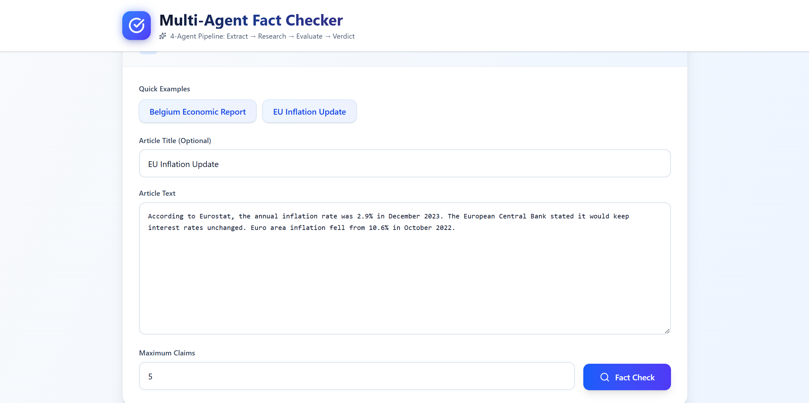
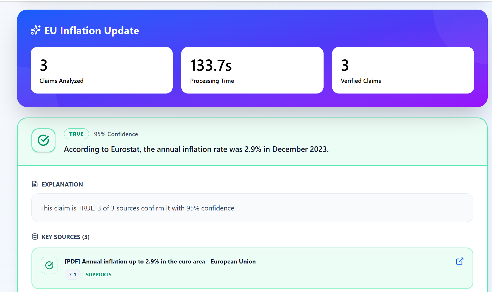

# Multi-Agent News Fact-Checker

> A production-ready, AI-powered fact-checking system using a collaborative multi-agent architecture with real-time web search and LLM-based evidence evaluation.

[](https://www.python.org/downloads/)
[](https://fastapi.tiangolo.com/)
[](https://reactjs.org/)
[](LICENSE)




## Features

- **Multi-Agent Pipeline**: Four specialized AI agents working collaboratively
- **Real-Time Web Search**: Powered by Serper API with authority-weighted ranking
- **LLM-Powered Analysis**: Ollama/Groq integration for intelligent query planning and evidence evaluating
- **Credibility Scoring**: Evidence evaluation with consensus detection
- **Fast & Scalable**: Async FastAPI backend with React frontend

##  How It Works

The system processes news articles through a 4-stage pipeline:

```
Article Input → Claim Extraction → Evidence Research → Evaluation → Verdict
```

### Pipeline Stages

1. **Claim Extraction Agent**
   - Identifies verifiable factual claims (statistics, dates, attributions)
   - Filters out opinions and non-verifiable statements
   - Confidence scoring for each claim

2. **Research Agent**
   - Generates optimized search queries (LLM-powered or heuristic)
   - Executes web searches via Serper API
   - Authority-weighted ranking (prioritizes .gov, academic sources)
   - Spam domain filtering

3. **Evidence Evaluation Agent**
   - Assesses source credibility (4-tier system)
   - Stance classification (supports/refutes/unclear)
   - Temporal relevance scoring
   - Consensus detection across sources

4. **Verdict Agent**
   - Synthesizes evaluation into final verdict
   - 5-level rating system (TRUE, MOSTLY_TRUE, MIXED, MOSTLY_FALSE, FALSE)
   - Confidence scoring and reasoning generation
   - Key source highlighting

### Example

**Input:**
```
"Belgium's GDP grew by 1.5% in 2023 according to Eurostat."
```

**Output:**
```json
{
  "claim": "Belgium's GDP grew by 1.5% in 2023",
  "verdict": "TRUE",
  "confidence": 0.92,
  "sources": [
    {
      "url": "https://ec.europa.eu/eurostat/...",
      "title": "GDP Growth Statistics - Eurostat",
      "credibility_tier": 1
    }
  ],
  "reasoning": "This claim is strongly supported by official Eurostat data..."
}
```

## Architecture

```
┌─────────────────┐
│  React Frontend │
│  (Vite + TS)    │
└────────┬────────┘
         │ REST API
         ▼
┌─────────────────┐
│  FastAPI Server │
│  (Async Python) │
└────────┬────────┘
         │
    ┌────┴────┬──────────┬──────────┐
    ▼         ▼          ▼          ▼
┌────────┐ ┌────────┐ ┌────────┐ ┌────────┐
│Agent 1 │ │Agent 2 │ │Agent 3 │ │Agent 4 │
│ Claim  │ │Research│ │Evidence│ │Verdict │
│Extract │ │ Search │ │  Eval  │ │  Gen   │
└────────┘ └───┬────┘ └────────┘ └────────┘
               │──────────│
         ┌─────┴     ┬──────────┐
         ▼           ▼          ▼
    ┌────────┐  ┌────────┐  ┌────────┐
    │ Serper │  │ Ollama │  │  Groq  │
    │  API   │  │  LLM   │  │  API   │
    └────────┘  └────────┘  └────────┘
```

### Key Design Principles

- **Separation of Concerns**: Each agent has a single, well-defined responsibility
- **Observable**: Structured logging with trace IDs for debugging
- **Type-Safe**: Full typing with Pydantic models and TypedDicts
- **Modular**: Clean interfaces between components
- **Testable**: Unit tests for each agent module

## Quick Start

### Prerequisites

- **Python 3.12+**
- **Node.js 18+** and npm
- **Serper API key** ([Get one free](https://serper.dev))
- **Ollama** (optional, for LLM query planning) or **Groq API key**

### Backend Setup

```bash
# Clone repository
git clone https://github.com/lizakolosova/multi-agent-fact-checker.git
cd multi-agent-fact-checker

# Create virtual environment
python -m venv .venv
source .venv/bin/activate  # On Windows: .venv\Scripts\activate

# Install dependencies
pip install -r requirements.txt

# Configure environment variables
cp .env.example .env
# Edit .env and add your API keys:
# SERPER_API_KEY=your_serper_key_here
# GROQ_API_KEY=your_groq_key_here  # Optional

# Start backend server
uvicorn news_fact_checker.api.main:app --reload
```

Backend will be available at: http://localhost:8000

API Documentation: http://localhost:8000/docs

### Frontend Setup

```bash
# Navigate to frontend directory
cd frontend

# Install dependencies
npm install

# Start development server
npm run dev
```

Frontend will be available at: http://localhost:5173

### Using Ollama

For local LLM-powered query planning:

```bash
# Install Ollama (https://ollama.com)
ollama pull llama3

# Start Ollama server
ollama serve
```

The system will automatically detect and use Ollama if available.

## API Documentation

### Endpoints

#### `POST /fact-check/article`

Fact-check a news article.

**Request:**
```json
{
  "article_id": "unique-id",
  "title": "Article Title",
  "text": "Article content to fact-check...",
  "max_claims": 5
}
```

**Response:**
```json
{
  "article_id": "unique-id",
  "title": "Article Title",
  "verdicts": [
    {
      "claim_id": "claim-123",
      "claim_text": "Belgium's GDP grew by 1.5% in 2023",
      "rating": "TRUE",
      "confidence": 0.92,
      "explanation": "This claim is strongly supported...",
      "sources": [
        {
          "url": "https://example.com/source",
          "title": "Source Title",
          "credibility": 0.95
        }
      ],
      "meta": {
        "consensus_level": "strong_support",
        "evidence_quality": 0.88
      }
    }
  ],
  "duration_ms": 12450
}
```

#### `GET /health`

Health check endpoint.

**Response:**
```json
{
  "status": "healthy",
  "serper_api_configured": true,
  "ollama_available": true,
  "timestamp": 1706105678
}
```

## Tech Stack

### Backend

- **[FastAPI](https://fastapi.tiangolo.com/)** - Modern, async web framework
- **[Pydantic](https://pydantic-docs.helpmanual.io/)** - Data validation
- **[structlog](https://www.structlog.org/)** - Structured logging
- **[httpx](https://www.python-httpx.org/)** - Async HTTP client
- **[python-dotenv](https://github.com/theskumar/python-dotenv)** - Environment management

### AI/ML

- **[Ollama](https://ollama.com/)** - Local LLM inference
- **[Groq](https://groq.com/)** - Fast cloud LLM inference
- **[Serper API](https://serper.dev/)** - Real-time web search

### Frontend

- **[React 18](https://reactjs.org/)** - UI framework
- **[Vite](https://vitejs.dev/)** - Build tool
- **[TypeScript](https://www.typescriptlang.org/)** - Type safety
- **[Tailwind CSS](https://tailwindcss.com/)** - Styling
- **[Axios](https://axios-http.com/)** - HTTP client

## Configuration

### Environment Variables

Create a `.env` file in the project root:

```bash
# Required
SERPER_API_KEY=your_serper_api_key_here

# Optional - LLM providers (choose one)
GROQ_API_KEY=your_groq_api_key_here

# Optional - Research configuration
RESEARCH_MAX_EVIDENCE=10
RESEARCH_MIN_EVIDENCE=3
RESEARCH_TIMEOUT=30
ENABLE_LLM_PLANNING=true

# Optional - Server configuration
BACKEND_HOST=0.0.0.0
BACKEND_PORT=8000
FRONTEND_PORT=5173
```

### Advanced Configuration

Research agent configuration in `news_fact_checker/research/config.py`:

```python
@dataclass
class ResearchConfig:
    search_api_key: str
    min_evidence: int = 3
    max_evidence: int = 10
    per_query_results: int = 3
    search_timeout: int = 30
    enable_llm_planning: bool = True
    llm_temperature: float = 0.0
```

##  Testing

```bash
# Run all tests
pytest

# Run with coverage
pytest --cov=news_fact_checker --cov-report=html

# Run specific test file
pytest tests/test_research.py -v

# Run with logging
pytest -v -s
```